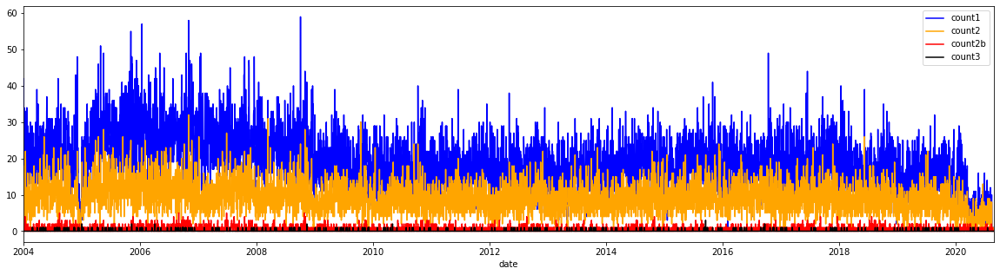
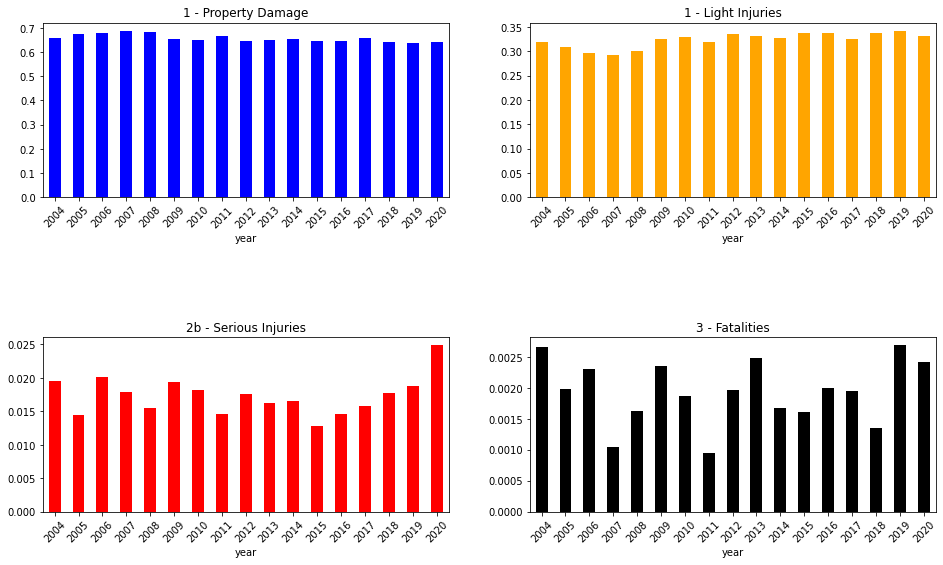

# Car accident severity predictor

This is the project report by Katharina Egert, submitted October 2020.

## 1. Introduction

The objective of this project is to create a way to predict severity of car accidents happening based on road and weather conditions.
That is, our algorithm needs to take as input the conditions that may impact severity of accidents:

* road conditions
* weather conditions
* lighting conditions

etc.

and predict the risk profile of potential accidents, i.e. the severity label. A user should then be able to specify the current conditions
of their itinerary and should then get back the severity label of accidents happening.

Example: A wet road should potential lead to higher severity accidents than a dry road.

The main stakeholders are:

* __traffic regulators__: They can make policies (e.g. speed limits, higher controls etc) in order to mitigate risks.
* __drivers__: They can recognize risks in advance and adapt their behavior in order to lower their own personal risks, e.g. drive more carefully or even avoid travelling at at risk conditions all together.

## 2. Data 

In this section we will descibe the underlying data.

### 2.1 Data Source

The given data set contains all collisions provided by Seattle police departement and recorded by Traffic Records. The level of aggregation is
weekly. The timeframe is 2004 to today.
(See metadata from the SPD Collision data set.)

### 2.2 Data Loading
In the next step, we load the data into the notebook and display the first 5 lines of the raw table. Not all columns will be used and some will need to be transformed in order to be exploitable for our later classification.

<table border="1" class="dataframe">
  <thead>
    <tr style="text-align: right;">
      <th></th>
      <th>X</th>
      <th>Y</th>
      <th>OBJECTID</th>
      <th>INCKEY</th>
      <th>COLDETKEY</th>
      <th>REPORTNO</th>
      <th>STATUS</th>
      <th>ADDRTYPE</th>
      <th>INTKEY</th>
      <th>LOCATION</th>
      <th>...</th>
      <th>ROADCOND</th>
      <th>LIGHTCOND</th>
      <th>PEDROWNOTGRNT</th>
      <th>SDOTCOLNUM</th>
      <th>SPEEDING</th>
      <th>ST_COLCODE</th>
      <th>ST_COLDESC</th>
      <th>SEGLANEKEY</th>
      <th>CROSSWALKKEY</th>
      <th>HITPARKEDCAR</th>
    </tr>
  </thead>
  <tbody>
    <tr>
      <th>0</th>
      <td>-122.356511</td>
      <td>47.517361</td>
      <td>1</td>
      <td>327920</td>
      <td>329420</td>
      <td>3856094</td>
      <td>Matched</td>
      <td>Intersection</td>
      <td>34911.0</td>
      <td>17TH AVE SW AND SW ROXBURY ST</td>
      <td>...</td>
      <td>Dry</td>
      <td>Daylight</td>
      <td>NaN</td>
      <td>NaN</td>
      <td>NaN</td>
      <td>10</td>
      <td>Entering at angle</td>
      <td>0</td>
      <td>0</td>
      <td>N</td>
    </tr>
    <tr>
      <th>1</th>
      <td>-122.361405</td>
      <td>47.702064</td>
      <td>2</td>
      <td>46200</td>
      <td>46200</td>
      <td>1791736</td>
      <td>Matched</td>
      <td>Block</td>
      <td>NaN</td>
      <td>HOLMAN RD NW BETWEEN 4TH AVE NW AND 3RD AVE NW</td>
      <td>...</td>
      <td>Wet</td>
      <td>Dusk</td>
      <td>NaN</td>
      <td>5101020.0</td>
      <td>NaN</td>
      <td>13</td>
      <td>From same direction - both going straight - bo...</td>
      <td>0</td>
      <td>0</td>
      <td>N</td>
    </tr>
    <tr>
      <th>2</th>
      <td>-122.317414</td>
      <td>47.664028</td>
      <td>3</td>
      <td>1212</td>
      <td>1212</td>
      <td>3507861</td>
      <td>Matched</td>
      <td>Block</td>
      <td>NaN</td>
      <td>ROOSEVELT WAY NE BETWEEN NE 47TH ST AND NE 50T...</td>
      <td>...</td>
      <td>Dry</td>
      <td>Dark - Street Lights On</td>
      <td>NaN</td>
      <td>NaN</td>
      <td>NaN</td>
      <td>30</td>
      <td>From opposite direction - all others</td>
      <td>0</td>
      <td>0</td>
      <td>N</td>
    </tr>
    <tr>
      <th>3</th>
      <td>-122.318234</td>
      <td>47.619927</td>
      <td>4</td>
      <td>327909</td>
      <td>329409</td>
      <td>EA03026</td>
      <td>Matched</td>
      <td>Intersection</td>
      <td>29054.0</td>
      <td>11TH AVE E AND E JOHN ST</td>
      <td>...</td>
      <td>Wet</td>
      <td>Dark - Street Lights On</td>
      <td>NaN</td>
      <td>NaN</td>
      <td>NaN</td>
      <td>0</td>
      <td>Vehicle going straight hits pedestrian</td>
      <td>0</td>
      <td>0</td>
      <td>N</td>
    </tr>
    <tr>
      <th>4</th>
      <td>-122.351724</td>
      <td>47.560306</td>
      <td>5</td>
      <td>104900</td>
      <td>104900</td>
      <td>2671936</td>
      <td>Matched</td>
      <td>Block</td>
      <td>NaN</td>
      <td>WEST MARGINAL WAY SW BETWEEN SW ALASKA ST AND ...</td>
      <td>...</td>
      <td>Ice</td>
      <td>Dark - Street Lights On</td>
      <td>NaN</td>
      <td>9359012.0</td>
      <td>Y</td>
      <td>50</td>
      <td>Fixed object</td>
      <td>0</td>
      <td>0</td>
      <td>N</td>
    </tr>
  </tbody>
</table>

5 rows × 40 columns

### 2.3 Data Description

The problem consists in predicting accident severity based on outer conditions of accidents recorded. 
The label to be predicted is 'SEVERITYCODE'. A description of the severity is contained in the column 'SEVERITYDESC' and 'SEVERITYCODE.1'
which is therefore redundant.

The following columns are of a technical nature and therefore of no use to us:

* 'OBJECTID',
* 'INCKEY', 
* 'COLDETKEY', 
* 'REPORTNO',
* 'STATUS'
* 'INTKEY'
* 'EXCEPTRSNCODE',
* 'EXCEPTRSNDESC'

There are several other fields in the data which might be good predictors for severity, however it does not make sense to use these for this problem as traffic planers as well as drivers will not be able to input this data when using this analysis. Example: for pedestrian/cyclist count (which is actually depending on the dependent variable!) as one will not know how many pedestrians/bikes will be on the road on a given day. 

The total list of colums concerned is:
* 'PERSONCOUNT', 
* 'PEDCOUNT', 
* 'PEDCYLCOUNT', 
* 'VEHCOUNT',
* 'INATTENTIONIND',
* 'HITPARKEDCAR',
* 'HITPARKEDCAR',
* 'PEDROWNOTGRNT',
* 'SDOTCOLNUM', 
* 'ST_COLCODE', 
* 'ST_COLDESC',
* 'SEGLANEKEY', 
* 'CROSSWALKKEY',
* 'SDOT_COLCODE'
* 'SDOT_COLDESC',
* 'COLLISIONTYPE',

The colums that can be explored are
* 'ADDRTYPE', 'X', 'Y'
* 'LOCATION',
* 'INCDATE' and 'INCDTTM',
* 'JUNCTIONTYPE',
* 'WEATHER'
* 'ROADCOND', 
* 'LIGHTCOND'
* 'UNDERINFL'
* 'SPEEDING'
       
  

# 3. Methodology
This section represents the main component of the report where I will discuss and describe exploratory data analysis and inferential statistical testing performed.

### 3.1 Label analysis
We need to predict severity of the accident given by the data colum 'SEVERITYCODE'. The following codes are given:

* 3—fatality 
* 2b—serious injury
* 2—injury
* 1—property damage
* 0—unknown

We will now analyze the frequency of their occurrences. The first static gives the absolute frequency, the second one the relative frequency.

We check now the total frequency of occurrences.

    1     137776
    2      58842
    2b      3111
    3        352
    Name: SEVERITYCODE, dtype: int64

    1     0.688601
    2     0.294091
    2b    0.015549
    3     0.001759
    Name: SEVERITYCODE, dtype: float64

Overall, light accidents dominate by nearly 2/3 and the remainder is mostly light injuries. Heavy injuries consist only of 1.5% and fatalities about 0.2%, thus much more limited and thus much less significant data. 

This means that out data set is unbalanced, hence we need to try later on to account for this imbalance.

Secondly, for the algorithm to make sense from the stake holder point of view, it is much more important to detect the risk of potential injury-type accidents than misclassifiying an actual property damage case, since one is rather too careful than take too much risk. This will help us shape the cost function.

###  3.2 Feature selection

In this section, we will select the features which determine the features to use. For this we will first use business knowledge to select obvious factors and then also check which column seems to have the most impact on the severity outcome. 

* 'WEATHER' containing data on the weather such at if it was dry or wet etc.
* 'ROADCOND' containing information whether the road was dry, wet etc.
* 'LIGHTCOND' containing data on lighting, e.g. if it was dark.

We will check for these three first and eliminate unusable columns.

<!--

 'INATTENTIONIND', 'UNDERINFL', 'SPEEDING',

Full colums
SEVERITYCODE', 'X', 'Y', 'OBJECTID', 'INCKEY', 'COLDETKEY', 'REPORTNO',
       'STATUS', 'ADDRTYPE', 'INTKEY', 'LOCATION', 'EXCEPTRSNCODE',
       'EXCEPTRSNDESC', 'SEVERITYCODE.1', 'SEVERITYDESC', 'COLLISIONTYPE',
       'PERSONCOUNT', 'PEDCOUNT', 'PEDCYLCOUNT', 'VEHCOUNT', 'INCDATE',
       'INCDTTM', 'JUNCTIONTYPE', 'SDOT_COLCODE', 'SDOT_COLDESC',
       'INATTENTIONIND', 'UNDERINFL', 'WEATHER', 'ROADCOND', 'LIGHTCOND',
       'PEDROWNOTGRNT', 'SDOTCOLNUM', 'SPEEDING', 'ST_COLCODE', 'ST_COLDESC',
       'SEGLANEKEY', 'CROSSWALKKEY', 'HITPARKEDCAR'-->
       
#### 'WEATHER'

We first check for the values.

    Clear                       114806
    Raining                      34037
    Overcast                     28555
    Unknown                      15131
    Snowing                        919
    Other                          860
    Fog/Smog/Smoke                 577
    Sleet/Hail/Freezing Rain       116
    Blowing Sand/Dirt               56
    Severe Crosswind                26
    Partly Cloudy                   10
    Blowing Snow                     1
    Name: WEATHER, dtype: int64

Now we're interested to see which of these conditions correlate with higher rates of severeness of accidents. Let's first have a look at absolute occurences and then relative frequencies.

    Absolute Frequencies:

<table border="1" class="dataframe">
  <thead>
    <tr style="text-align: right;">
      <th>SEVERITYCODE</th>
      <th>1</th>
      <th>2</th>
      <th>2b</th>
      <th>3</th>
    </tr>
    <tr>
      <th>WEATHER</th>
      <th></th>
      <th></th>
      <th></th>
      <th></th>
    </tr>
  </thead>
  <tbody>
    <tr>
      <th>Blowing Sand/Dirt</th>
      <td>0.732</td>
      <td>0.268</td>
      <td>0.000</td>
      <td>0.000</td>
    </tr>
    <tr>
      <th>Blowing Snow</th>
      <td>0.000</td>
      <td>0.000</td>
      <td>1.000</td>
      <td>0.000</td>
    </tr>
    <tr>
      <th>Clear</th>
      <td>0.664</td>
      <td>0.317</td>
      <td>0.018</td>
      <td>0.002</td>
    </tr>
    <tr>
      <th>Fog/Smog/Smoke</th>
      <td>0.664</td>
      <td>0.326</td>
      <td>0.005</td>
      <td>0.005</td>
    </tr>
    <tr>
      <th>Other</th>
      <td>0.849</td>
      <td>0.140</td>
      <td>0.008</td>
      <td>0.003</td>
    </tr>
    <tr>
      <th>Overcast</th>
      <td>0.672</td>
      <td>0.310</td>
      <td>0.016</td>
      <td>0.002</td>
    </tr>
    <tr>
      <th>Partly Cloudy</th>
      <td>0.500</td>
      <td>0.400</td>
      <td>0.000</td>
      <td>0.100</td>
    </tr>
    <tr>
      <th>Raining</th>
      <td>0.651</td>
      <td>0.332</td>
      <td>0.016</td>
      <td>0.001</td>
    </tr>
    <tr>
      <th>Severe Crosswind</th>
      <td>0.692</td>
      <td>0.269</td>
      <td>0.000</td>
      <td>0.038</td>
    </tr>
    <tr>
      <th>Sleet/Hail/Freezing Rain</th>
      <td>0.733</td>
      <td>0.250</td>
      <td>0.017</td>
      <td>0.000</td>
    </tr>
    <tr>
      <th>Snowing</th>
      <td>0.803</td>
      <td>0.186</td>
      <td>0.011</td>
      <td>0.000</td>
    </tr>
    <tr>
      <th>Unknown</th>
      <td>0.943</td>
      <td>0.054</td>
      <td>0.003</td>
      <td>0.000</td>
    </tr>
  </tbody>
</table>

We see again heavy imbalanced-ness of the data. We can mitigate this by using out domain knowledge to group the data appropriately.

We check the frequencies now visually.

__Observations:__

1. Most accidents happen at clear, overcast weather ('mild') or when it's raining. This is no surprise as these are the most common weather situations.
1. Most fatalities and heavy injuries also happen at mild weather or when it's raining.
1. Bad conditions such as snowing, while intuitively making up for a big risk, has actually a lower risk for severity. Perhaps drivers are already taking this risk into account and drive more carefully.
1. The most fatal weather is partly cloudy, having however not much data.

__Key takeaway__

Severe accidents happen most when it's raining or mild. Really adverse conditions are more associated with property damage or, a bit higher than for other conditions, mild injuries.

### 'ROADCOND'

We do the exact same thing for road conditions. We'll start with frequency.

    Dry               128660
    Wet                48734
    Unknown            15139
    Ice                 1232
    Snow/Slush          1014
    Other                136
    Standing Water       119
    Sand/Mud/Dirt         77
    Oil                   64
    Name: ROADCOND, dtype: int64

We note that, again, the main categories 'Dry' and 'Wet' dominate a lot the dataset. The two last categories have hardly enough data points. We check now for absolute and relative frequencies per severity code.

    Absolute frequency:

<table border="1" class="dataframe">
  <thead>
    <tr style="text-align: right;">
      <th>SEVERITYCODE</th>
      <th>1</th>
      <th>2</th>
      <th>2b</th>
      <th>3</th>
    </tr>
    <tr>
      <th>ROADCOND</th>
      <th></th>
      <th></th>
      <th></th>
      <th></th>
    </tr>
  </thead>
  <tbody>
    <tr>
      <th>Dry</th>
      <td>85505</td>
      <td>40644</td>
      <td>2243</td>
      <td>268</td>
    </tr>
    <tr>
      <th>Ice</th>
      <td>938</td>
      <td>275</td>
      <td>18</td>
      <td>1</td>
    </tr>
    <tr>
      <th>Oil</th>
      <td>40</td>
      <td>24</td>
      <td>0</td>
      <td>0</td>
    </tr>
    <tr>
      <th>Other</th>
      <td>90</td>
      <td>43</td>
      <td>3</td>
      <td>0</td>
    </tr>
    <tr>
      <th>Sand/Mud/Dirt</th>
      <td>54</td>
      <td>23</td>
      <td>0</td>
      <td>0</td>
    </tr>
    <tr>
      <th>Snow/Slush</th>
      <td>839</td>
      <td>167</td>
      <td>8</td>
      <td>0</td>
    </tr>
    <tr>
      <th>Standing Water</th>
      <td>86</td>
      <td>30</td>
      <td>3</td>
      <td>0</td>
    </tr>
    <tr>
      <th>Unknown</th>
      <td>14353</td>
      <td>755</td>
      <td>30</td>
      <td>1</td>
    </tr>
    <tr>
      <th>Wet</th>
      <td>32000</td>
      <td>15906</td>
      <td>759</td>
      <td>69</td>
    </tr>
  </tbody>
</table>

    Relative frequency:

<table border="1" class="dataframe">
  <thead>
    <tr style="text-align: right;">
      <th>SEVERITYCODE</th>
      <th>1</th>
      <th>2</th>
      <th>2b</th>
      <th>3</th>
    </tr>
    <tr>
      <th>ROADCOND</th>
      <th></th>
      <th></th>
      <th></th>
      <th></th>
    </tr>
  </thead>
  <tbody>
    <tr>
      <th>Dry</th>
      <td>0.664581</td>
      <td>0.315902</td>
      <td>0.017434</td>
      <td>0.002083</td>
    </tr>
    <tr>
      <th>Ice</th>
      <td>0.761364</td>
      <td>0.223214</td>
      <td>0.014610</td>
      <td>0.000812</td>
    </tr>
    <tr>
      <th>Oil</th>
      <td>0.625000</td>
      <td>0.375000</td>
      <td>0.000000</td>
      <td>0.000000</td>
    </tr>
    <tr>
      <th>Other</th>
      <td>0.661765</td>
      <td>0.316176</td>
      <td>0.022059</td>
      <td>0.000000</td>
    </tr>
    <tr>
      <th>Sand/Mud/Dirt</th>
      <td>0.701299</td>
      <td>0.298701</td>
      <td>0.000000</td>
      <td>0.000000</td>
    </tr>
    <tr>
      <th>Snow/Slush</th>
      <td>0.827416</td>
      <td>0.164694</td>
      <td>0.007890</td>
      <td>0.000000</td>
    </tr>
    <tr>
      <th>Standing Water</th>
      <td>0.722689</td>
      <td>0.252101</td>
      <td>0.025210</td>
      <td>0.000000</td>
    </tr>
    <tr>
      <th>Unknown</th>
      <td>0.948081</td>
      <td>0.049871</td>
      <td>0.001982</td>
      <td>0.000066</td>
    </tr>
    <tr>
      <th>Wet</th>
      <td>0.656626</td>
      <td>0.326384</td>
      <td>0.015574</td>
      <td>0.001416</td>
    </tr>
  </tbody>
</table>

__Observations__

1. Wet and dry are again the most fatal categories, also in relative terms.
1. Adverse conditions seem to again favor property damage only accidents.
1. We can drop again unknown and other categories.

After elimination of these columns, we have the following average severities.

    1     0.664047
    2     0.317226
    2b    0.016848
    3     0.001879
    Name: SEVERITYCODE, dtype: float64

### 'LIGHTCOND'

We do the exact same thing for light conditions. We'll start with frequency.

    Daylight                    116661
    Dark - Street Lights On      48847
    Dusk                          5893
    Unknown                       2852
    Dawn                          2547
    Dark - No Street Lights       1486
    Dark - Street Lights Off      1182
    Other                          217
    Dark - Unknown Lighting         22
    Name: LIGHTCOND, dtype: int64

<table border="1" class="dataframe">
  <thead>
    <tr style="text-align: right;">
      <th>SEVERITYCODE</th>
      <th>1</th>
      <th>2</th>
      <th>2b</th>
      <th>3</th>
    </tr>
    <tr>
      <th>LIGHTCOND</th>
      <th></th>
      <th></th>
      <th></th>
      <th></th>
    </tr>
  </thead>
  <tbody>
    <tr>
      <th>Dark - No Street Lights</th>
      <td>0.759085</td>
      <td>0.223419</td>
      <td>0.016824</td>
      <td>0.000673</td>
    </tr>
    <tr>
      <th>Dark - Street Lights Off</th>
      <td>0.708122</td>
      <td>0.264805</td>
      <td>0.023689</td>
      <td>0.003384</td>
    </tr>
    <tr>
      <th>Dark - Street Lights On</th>
      <td>0.679100</td>
      <td>0.297091</td>
      <td>0.020841</td>
      <td>0.002968</td>
    </tr>
    <tr>
      <th>Dark - Unknown Lighting</th>
      <td>0.636364</td>
      <td>0.363636</td>
      <td>0.000000</td>
      <td>0.000000</td>
    </tr>
    <tr>
      <th>Dawn</th>
      <td>0.649391</td>
      <td>0.325088</td>
      <td>0.023557</td>
      <td>0.001963</td>
    </tr>
    <tr>
      <th>Daylight</th>
      <td>0.650903</td>
      <td>0.332459</td>
      <td>0.015198</td>
      <td>0.001440</td>
    </tr>
    <tr>
      <th>Dusk</th>
      <td>0.651790</td>
      <td>0.327847</td>
      <td>0.017987</td>
      <td>0.002376</td>
    </tr>
    <tr>
      <th>Other</th>
      <td>0.737327</td>
      <td>0.244240</td>
      <td>0.018433</td>
      <td>0.000000</td>
    </tr>
    <tr>
      <th>Unknown</th>
      <td>0.904278</td>
      <td>0.091515</td>
      <td>0.003857</td>
      <td>0.000351</td>
    </tr>
  </tbody>
</table>

__Observations:__

1. Our domain knowledge tells us, the darker the more risky.
1. Most accidents happen at daylight, so lighting does not fully explain higher severity accidents.
1. Most severe accidents happen in the dark.
1. Domain: Dusk/dawn are similar, also no streetlights when dark, so we can group these together.

We drop again 'Unknown', 'Other', 'Dark - Unknown Lighting' and missing values.

    daylight            116661
    dark with lights     48847
    dusk/dawn             8440
    dark - no lights      2668
    Name: LIGHTCOND, dtype: int64

<table border="1" class="dataframe">
  <thead>
    <tr style="text-align: right;">
      <th>SEVERITYCODE</th>
      <th>1</th>
      <th>2</th>
      <th>2b</th>
      <th>3</th>
    </tr>
    <tr>
      <th>LIGHTCOND</th>
      <th></th>
      <th></th>
      <th></th>
      <th></th>
    </tr>
  </thead>
  <tbody>
    <tr>
      <th>dark - no lights</th>
      <td>0.736507</td>
      <td>0.241754</td>
      <td>0.019865</td>
      <td>0.001874</td>
    </tr>
    <tr>
      <th>dark with lights</th>
      <td>0.679100</td>
      <td>0.297091</td>
      <td>0.020841</td>
      <td>0.002968</td>
    </tr>
    <tr>
      <th>daylight</th>
      <td>0.650903</td>
      <td>0.332459</td>
      <td>0.015198</td>
      <td>0.001440</td>
    </tr>
    <tr>
      <th>dusk/dawn</th>
      <td>0.651066</td>
      <td>0.327014</td>
      <td>0.019668</td>
      <td>0.002251</td>
    </tr>
  </tbody>
</table>

__Key observations:__ 

1. The most fatal conditions are dark nights with lighting followed by dusk and dawn. 
1. Most safest to drive is daylight follwed by dark with no lights, where there are probably less people on the route. 

### Time dimension

We do get a timing dimension via 'INCDTTM'. First, we need to cast this column as datetime.

    0   2020-01-19 09:01:00
    1   2005-04-11 18:31:00
    2   2013-03-31 02:09:00
    3   2020-01-06 17:55:00
    4   2009-12-25 19:00:00
    Name: INCDTTM, dtype: datetime64[ns]

Next, we extract dates (for our time series), extract the hour as well as the weekday.

#### Dates

__Observations__
1. We see a difference between years. Therefore it might make sense to introduce a per year variable.  
1. Additionally, there seems to be a by month seasonality and potentially a per week seasonality.

#### Years

We take a look at relative decomposition of accidents.

<table border="1" class="dataframe">
  <thead>
    <tr style="text-align: right;">
      <th>SEVERITYCODE</th>
      <th>1</th>
      <th>2</th>
      <th>2b</th>
      <th>3</th>
    </tr>
    <tr>
      <th>year</th>
      <th></th>
      <th></th>
      <th></th>
      <th></th>
    </tr>
  </thead>
  <tbody>
    <tr>
      <th>2004</th>
      <td>0.659143</td>
      <td>0.318640</td>
      <td>0.019561</td>
      <td>0.002655</td>
    </tr>
    <tr>
      <th>2005</th>
      <td>0.674683</td>
      <td>0.308906</td>
      <td>0.014430</td>
      <td>0.001981</td>
    </tr>
    <tr>
      <th>2006</th>
      <td>0.680042</td>
      <td>0.297448</td>
      <td>0.020203</td>
      <td>0.002307</td>
    </tr>
    <tr>
      <th>2007</th>
      <td>0.687709</td>
      <td>0.293330</td>
      <td>0.017920</td>
      <td>0.001041</td>
    </tr>
    <tr>
      <th>2008</th>
      <td>0.682837</td>
      <td>0.300041</td>
      <td>0.015491</td>
      <td>0.001631</td>
    </tr>
    <tr>
      <th>2009</th>
      <td>0.653177</td>
      <td>0.325115</td>
      <td>0.019350</td>
      <td>0.002357</td>
    </tr>
    <tr>
      <th>2010</th>
      <td>0.651407</td>
      <td>0.328454</td>
      <td>0.018271</td>
      <td>0.001869</td>
    </tr>
    <tr>
      <th>2011</th>
      <td>0.665082</td>
      <td>0.319286</td>
      <td>0.014681</td>
      <td>0.000951</td>
    </tr>
    <tr>
      <th>2012</th>
      <td>0.645121</td>
      <td>0.335261</td>
      <td>0.017656</td>
      <td>0.001962</td>
    </tr>
    <tr>
      <th>2013</th>
      <td>0.648829</td>
      <td>0.332506</td>
      <td>0.016183</td>
      <td>0.002481</td>
    </tr>
    <tr>
      <th>2014</th>
      <td>0.654661</td>
      <td>0.327033</td>
      <td>0.016624</td>
      <td>0.001682</td>
    </tr>
    <tr>
      <th>2015</th>
      <td>0.647497</td>
      <td>0.338079</td>
      <td>0.012822</td>
      <td>0.001603</td>
    </tr>
    <tr>
      <th>2016</th>
      <td>0.645699</td>
      <td>0.337648</td>
      <td>0.014656</td>
      <td>0.001998</td>
    </tr>
    <tr>
      <th>2017</th>
      <td>0.657182</td>
      <td>0.325120</td>
      <td>0.015743</td>
      <td>0.001956</td>
    </tr>
    <tr>
      <th>2018</th>
      <td>0.643652</td>
      <td>0.337319</td>
      <td>0.017677</td>
      <td>0.001352</td>
    </tr>
    <tr>
      <th>2019</th>
      <td>0.636459</td>
      <td>0.342053</td>
      <td>0.018802</td>
      <td>0.002686</td>
    </tr>
    <tr>
      <th>2020</th>
      <td>0.641601</td>
      <td>0.331110</td>
      <td>0.024864</td>
      <td>0.002426</td>
    </tr>
  </tbody>
</table>

We sse that fatality rates vary with a factor two, while the other categories fluctuate, too, but a bit less. There is no clear linear trend, so we will need to use this variable categorically.

#### Month

<table border="1" class="dataframe">
  <thead>
    <tr style="text-align: right;">
      <th>SEVERITYCODE</th>
      <th>1</th>
      <th>2</th>
      <th>2b</th>
      <th>3</th>
    </tr>
    <tr>
      <th>month</th>
      <th></th>
      <th></th>
      <th></th>
      <th></th>
    </tr>
  </thead>
  <tbody>
    <tr>
      <th>1</th>
      <td>0.672813</td>
      <td>0.308341</td>
      <td>0.017281</td>
      <td>0.001565</td>
    </tr>
    <tr>
      <th>2</th>
      <td>0.677759</td>
      <td>0.304829</td>
      <td>0.015710</td>
      <td>0.001703</td>
    </tr>
    <tr>
      <th>3</th>
      <td>0.667260</td>
      <td>0.312611</td>
      <td>0.018691</td>
      <td>0.001438</td>
    </tr>
    <tr>
      <th>4</th>
      <td>0.662796</td>
      <td>0.320130</td>
      <td>0.015001</td>
      <td>0.002074</td>
    </tr>
    <tr>
      <th>5</th>
      <td>0.650234</td>
      <td>0.332443</td>
      <td>0.015108</td>
      <td>0.002214</td>
    </tr>
    <tr>
      <th>6</th>
      <td>0.664454</td>
      <td>0.318340</td>
      <td>0.016046</td>
      <td>0.001160</td>
    </tr>
    <tr>
      <th>7</th>
      <td>0.642606</td>
      <td>0.335394</td>
      <td>0.020307</td>
      <td>0.001692</td>
    </tr>
    <tr>
      <th>8</th>
      <td>0.644413</td>
      <td>0.333200</td>
      <td>0.020194</td>
      <td>0.002192</td>
    </tr>
    <tr>
      <th>9</th>
      <td>0.656129</td>
      <td>0.325083</td>
      <td>0.016292</td>
      <td>0.002496</td>
    </tr>
    <tr>
      <th>10</th>
      <td>0.648287</td>
      <td>0.332726</td>
      <td>0.017290</td>
      <td>0.001698</td>
    </tr>
    <tr>
      <th>11</th>
      <td>0.661734</td>
      <td>0.319055</td>
      <td>0.017243</td>
      <td>0.001969</td>
    </tr>
    <tr>
      <th>12</th>
      <td>0.677350</td>
      <td>0.304966</td>
      <td>0.014884</td>
      <td>0.002800</td>
    </tr>
  </tbody>
</table>

__Observations__

* Here we see a seasonality trend for winter and summer for property damage and light injuries, less so for serious injuries and fatalities.
* Fatalities grow at the end of year.
* There is no linear relationship, so we cannot use a numerical variable.

#### Hour

__Observations:__

1. During the day less serious accidents happen. 
1. At night, the peak hour for sever accidents is 1am.
1. The safest timeframe is in the morning.
1. The relationship is not linear, hence we cannot use it as a standard numerical variable.

#### Weekday

__Obervations:__

1. Tuesday is safest for fatalities, while Wednesdays and Sundays pose the highest risk.
1. All other weekdays are pretty much equal.

### Location type

As a driver, one knows that accidents are more likely at intersections. This information is stored in the variable 'ADDRTYPE'. 

    Block           111205
    Intersection     64054
    Alley              618
    Name: ADDRTYPE, dtype: int64

__Observations__ 

* Most deaths and serious injuries happen at intersections and blocks.
* Alleys are more prone for property damage.

### 'UNDERINFL'

We see that the data is not quite clean and we need to group it together.

    N    93557
    0    73538
    Y     5336
    1     4185
    Name: UNDERINFL, dtype: int64

__Observations__

* Not surprisingly, under influence of drugs and alcohol, serious injuries and fatalities are more likely. 
* Here traffic managers may administer more drug testing in order to make these driving conditions safer.

### 'SPEEDING'

Here, we take the same steps as for UNDERINFL.

__Observations__

Here, the same conclusion as for under influence: Serious injuries and fatalities rise when speeding.

#### Feature summary

We will therefore use

* WEATHER (transformed)
* ROADCOND
* LIGHTCOND (transformed)
* hour (transformed from date)
* weekday (transformed from date)
* month
* ADDRTYPE
* speeding
* underinfl

We therefore reduce the columns as follows:

<table border="1" class="dataframe">
  <thead>
    <tr style="text-align: right;">
      <th></th>
      <th>SEVERITYCODE</th>
      <th>WEATHER</th>
      <th>ROADCOND</th>
      <th>LIGHTCOND</th>
      <th>hour</th>
      <th>weekday</th>
      <th>ADDRTYPE</th>
      <th>year</th>
      <th>month</th>
      <th>speeding</th>
      <th>underinfl</th>
    </tr>
  </thead>
  <tbody>
    <tr>
      <th>0</th>
      <td>1</td>
      <td>mild</td>
      <td>Dry</td>
      <td>daylight</td>
      <td>b'9'</td>
      <td>7 - Sunday</td>
      <td>Intersection</td>
      <td>2020</td>
      <td>b'1'</td>
      <td>0</td>
      <td>0</td>
    </tr>
    <tr>
      <th>1</th>
      <td>1</td>
      <td>raining</td>
      <td>Wet</td>
      <td>dusk/dawn</td>
      <td>b'18'</td>
      <td>1 - Monday</td>
      <td>Block</td>
      <td>2005</td>
      <td>b'4'</td>
      <td>0</td>
      <td>0</td>
    </tr>
    <tr>
      <th>2</th>
      <td>2</td>
      <td>mild</td>
      <td>Dry</td>
      <td>dark with lights</td>
      <td>b'2'</td>
      <td>7 - Sunday</td>
      <td>Block</td>
      <td>2013</td>
      <td>b'3'</td>
      <td>0</td>
      <td>0</td>
    </tr>
    <tr>
      <th>3</th>
      <td>2</td>
      <td>raining</td>
      <td>Wet</td>
      <td>dark with lights</td>
      <td>b'17'</td>
      <td>1 - Monday</td>
      <td>Intersection</td>
      <td>2020</td>
      <td>b'1'</td>
      <td>0</td>
      <td>0</td>
    </tr>
    <tr>
      <th>4</th>
      <td>2</td>
      <td>mild</td>
      <td>Ice</td>
      <td>dark with lights</td>
      <td>b'19'</td>
      <td>5 - Friday</td>
      <td>Block</td>
      <td>2009</td>
      <td>b'12'</td>
      <td>1</td>
      <td>0</td>
    </tr>
  </tbody>
</table>

First we convert the categorical data into dummy variables encoding our categorical variables.

<table border="1" class="dataframe">
  <thead>
    <tr style="text-align: right;">
      <th></th>
      <th>SEVERITYCODE</th>
      <th>speeding</th>
      <th>underinfl</th>
      <th>WEATHER_bad</th>
      <th>WEATHER_mild</th>
      <th>WEATHER_raining</th>
      <th>WEATHER_unknown</th>
      <th>ROADCOND_Dry</th>
      <th>ROADCOND_Ice</th>
      <th>ROADCOND_Oil</th>
      <th>...</th>
      <th>month_b'11'</th>
      <th>month_b'12'</th>
      <th>month_b'2'</th>
      <th>month_b'3'</th>
      <th>month_b'4'</th>
      <th>month_b'5'</th>
      <th>month_b'6'</th>
      <th>month_b'7'</th>
      <th>month_b'8'</th>
      <th>month_b'9'</th>
    </tr>
  </thead>
  <tbody>
    <tr>
      <th>0</th>
      <td>1</td>
      <td>0</td>
      <td>0</td>
      <td>0</td>
      <td>1</td>
      <td>0</td>
      <td>0</td>
      <td>1</td>
      <td>0</td>
      <td>0</td>
      <td>...</td>
      <td>0</td>
      <td>0</td>
      <td>0</td>
      <td>0</td>
      <td>0</td>
      <td>0</td>
      <td>0</td>
      <td>0</td>
      <td>0</td>
      <td>0</td>
    </tr>
    <tr>
      <th>1</th>
      <td>1</td>
      <td>0</td>
      <td>0</td>
      <td>0</td>
      <td>0</td>
      <td>1</td>
      <td>0</td>
      <td>0</td>
      <td>0</td>
      <td>0</td>
      <td>...</td>
      <td>0</td>
      <td>0</td>
      <td>0</td>
      <td>0</td>
      <td>1</td>
      <td>0</td>
      <td>0</td>
      <td>0</td>
      <td>0</td>
      <td>0</td>
    </tr>
    <tr>
      <th>2</th>
      <td>2</td>
      <td>0</td>
      <td>0</td>
      <td>0</td>
      <td>1</td>
      <td>0</td>
      <td>0</td>
      <td>1</td>
      <td>0</td>
      <td>0</td>
      <td>...</td>
      <td>0</td>
      <td>0</td>
      <td>0</td>
      <td>1</td>
      <td>0</td>
      <td>0</td>
      <td>0</td>
      <td>0</td>
      <td>0</td>
      <td>0</td>
    </tr>
    <tr>
      <th>3</th>
      <td>2</td>
      <td>0</td>
      <td>0</td>
      <td>0</td>
      <td>0</td>
      <td>1</td>
      <td>0</td>
      <td>0</td>
      <td>0</td>
      <td>0</td>
      <td>...</td>
      <td>0</td>
      <td>0</td>
      <td>0</td>
      <td>0</td>
      <td>0</td>
      <td>0</td>
      <td>0</td>
      <td>0</td>
      <td>0</td>
      <td>0</td>
    </tr>
    <tr>
      <th>4</th>
      <td>2</td>
      <td>1</td>
      <td>0</td>
      <td>0</td>
      <td>1</td>
      <td>0</td>
      <td>0</td>
      <td>0</td>
      <td>1</td>
      <td>0</td>
      <td>...</td>
      <td>0</td>
      <td>1</td>
      <td>0</td>
      <td>0</td>
      <td>0</td>
      <td>0</td>
      <td>0</td>
      <td>0</td>
      <td>0</td>
      <td>0</td>
    </tr>
  </tbody>
</table>

5 rows × 81 columns

### 3.3 Machine learning models

We will try several variants of machine learning models.

* Logistic Regression
* Random Forests

#### 3.3.1 Creating Balance

First of all, we need to find a way to deal with the imbalanced-ness of data. This can be handled via weights for logistic regression reflecting the frequency of occurrence.

    Weight1: 0.7575728979899972
    Weight2: 1.5574053825261895
    Weight2b: 29.338205980066444
    Weight3: 262.0415430267062

#### 3.3.2 Train-test-split

Secondly, we need to split the data into a train and test set.

    Train set: (141292, 80) (141292,)
    Test set: (35324, 80) (35324,)

#### 3.3.3 Logistic Regression

Here, we model the probability of a feature set to result in either category. This algorithm is designed for binary decision problems, which is the case for this data set and the posed question.

__Model tuning__ We tune model performance by testing several hyperparameters using RandomizedSearchCV.

    LogisticRegression(C=1.0,
              class_weight={'1': 0.7575728979899972, '2': 1.5574053825261895, '2b': 29.338205980066444, '3': 262.0415430267062},
              dual=False, fit_intercept=True, intercept_scaling=1,
              max_iter=100, multi_class='warn', n_jobs=None, penalty='l2',
              random_state=None, solver='warn', tol=0.0001, verbose=0,
              warm_start=False)

We try a first, naive, logistic regression without tuning.

    Classification Report: Logistic Regression
                  precision    recall  f1-score   support
    
               1       0.72      0.73      0.72     23348
               2       0.43      0.34      0.38     11307
              2b       0.05      0.03      0.03       586
               3       0.01      0.31      0.02        83
    
       micro avg       0.59      0.59      0.59     35324
       macro avg       0.30      0.35      0.29     35324
    weighted avg       0.61      0.59      0.60     35324
    
    Accuracy: 59.16% (correctly classified test data)
    F1: 0.599509 (weighted average of recall and precision)

    Fitting 3 folds for each of 10 candidates, totalling 30 fits

    [Parallel(n_jobs=-1)]: Using backend LokyBackend with 4 concurrent workers.
    [Parallel(n_jobs=-1)]: Done  10 tasks      | elapsed:   56.9s
    [Parallel(n_jobs=-1)]: Done  30 out of  30 | elapsed:  5.9min remaining:    0.0s
    [Parallel(n_jobs=-1)]: Done  30 out of  30 | elapsed:  5.9min finished

    RandomizedSearchCV(cv=3, error_score='raise-deprecating',
              estimator=LogisticRegression(C=1.0,
              class_weight={'1': 0.7575728979899972, '2': 1.5574053825261895, '2b': 29.338205980066444, '3': 262.0415430267062},
              dual=False, fit_intercept=True, intercept_scaling=1,
              max_iter=100, multi_class='warn', n_jobs=None, penalty='l2',
              random_state=None, solver='warn', tol=0.0001, verbose=0,
              warm_start=False),
              fit_params=None, iid='warn', n_iter=10, n_jobs=-1,
              param_distributions={'penalty': ['l2'], 'C': array([1.00000e-04, 2.63665e-04, 6.95193e-04, 1.83298e-03, 4.83293e-03,
           1.27427e-02, 3.35982e-02, 8.85867e-02, 2.33572e-01, 6.15848e-01,
           1.62378e+00, 4.28133e+00, 1.12884e+01, 2.97635e+01, 7.84760e+01,
           2.06914e+02, 5.45559e+02, 1.43845e+03, 3.79269e+03, 1.00000e+04]), 'solver': ['newton-cg', 'saga', 'lbfgs']},
              pre_dispatch='2*n_jobs', random_state=0, refit=True,
              return_train_score='warn',
              scoring=make_scorer(f1_score, average=weighted), verbose=5)

    Classification Report: Logistic Regression
                  precision    recall  f1-score   support
    
               1       0.73      0.62      0.67     23348
               2       0.42      0.28      0.33     11307
              2b       0.03      0.17      0.04       586
               3       0.01      0.41      0.02        83
    
       micro avg       0.50      0.50      0.50     35324
       macro avg       0.30      0.37      0.27     35324
    weighted avg       0.62      0.50      0.55     35324
    
    Accuracy: 49.91% (correctly classified test data)
    F1: 0.549666 (weighted average of recall and precision)

Note that in this optimized version, recall for "2b" and "3" is better.

#### 3.3.4 Random Forests

Random forests are a good candidate because they are very versatile and will allow us to work with out categorical data.

    Fitting 3 folds for each of 10 candidates, totalling 30 fits

    [Parallel(n_jobs=-1)]: Using backend LokyBackend with 4 concurrent workers.
    [Parallel(n_jobs=-1)]: Done  10 tasks      | elapsed:  6.8min
    [Parallel(n_jobs=-1)]: Done  30 out of  30 | elapsed: 12.9min remaining:    0.0s
    [Parallel(n_jobs=-1)]: Done  30 out of  30 | elapsed: 12.9min finished

    RandomizedSearchCV(cv=3, error_score='raise-deprecating',
              estimator=RandomForestClassifier(bootstrap=True,
                class_weight={'1': 0.7575728979899972, '2': 1.5574053825261895, '2b': 29.338205980066444, '3': 262.0415430267062},
                criterion='gini', max_depth=None, max_features='auto',
                max_leaf_nodes=None, min_impurity_decrease=0....rs='warn', n_jobs=None, oob_score=False,
                random_state=None, verbose=0, warm_start=False),
              fit_params=None, iid='warn', n_iter=10, n_jobs=-1,
              param_distributions={'max_depth': [2, 5, 10, 20], 'max_features': [5, 7, 10, 15], 'n_estimators': [100, 200, 500, 700], 'min_samples_split': [10, 15, 20]},
              pre_dispatch='2*n_jobs', random_state=0, refit=True,
              return_train_score='warn',
              scoring=make_scorer(f1_score, average=weighted), verbose=5)

We can then extract the best model and fit the data.

    RandomForestClassifier(bootstrap=True,
                class_weight={'1': 0.7575728979899972, '2': 1.5574053825261895, '2b': 29.338205980066444, '3': 262.0415430267062},
                criterion='gini', max_depth=None, max_features='auto',
                max_leaf_nodes=None, min_impurity_decrease=0.0,
                min_impurity_split=None, min_samples_leaf=1,
                min_samples_split=2, min_weight_fraction_leaf=0.0,
                n_estimators=10, n_jobs=None, oob_score=False,
                random_state=None, verbose=0, warm_start=False)

    Classification Report: Random Forest
                  precision    recall  f1-score   support
    
               1       0.73      0.68      0.70     23348
               2       0.42      0.46      0.44     11307
              2b       0.04      0.07      0.05       586
               3       0.02      0.05      0.03        83
    
       micro avg       0.60      0.60      0.60     35324
       macro avg       0.30      0.31      0.30     35324
    weighted avg       0.62      0.60      0.60     35324
    
    Accuracy: 59.52% (correctly classified test data)
    F1: 0.604981 (weighted average of recall and precision)

So, random forests beat logistic regression in the F1-score. However, the recall for 2b and 3 is too low, hence we still choose Logistic regression.

## 4. Results
Out of our two approaches, logistic classification and random forests, we pick  logistic classification because of the better f1 score performance and the fact that the recall is better for severe injuries and fatalities.

### 4.1  Confusion matrix

The confusion matrix tells us how well our algorithm classifies our test data, e.g. for a given severity code, say fatalities, how many does the algorithm get right and puts into category 3 and how many does it put into other categories?

### 4.2. Feature importance

An interesting side result of the machine learning models we used is that we can extract which features that is which attributes of the accidents play an important role in determining the accident's severity. We get both negative and positive factors: The higher a positive factor, the bigger the higher the likelyhood of an accident of this severity. A negative factor means that this severity is much less likely to happen in the presence of this flag.

    Text(0.5, 1.0, 'Severity Code 1 - Property damage')

__Observations__

Property damage only accidents will __likely happen__ under the following conditions:

* Ice, snow/slush,
* Standing water,
* in alleys,
* between 2-4am.

Property damage only accidents are __less likely to happen__ under the following conditions:

* Blocks and intersections,
* in presence of speeding or intoxicated drivers.

__Observations__

Property damage only accidents will __likely happen__ under the following conditions:

* intersections and blocks,
* oil present,
* in presence of speeding or intoxicated drivers.

Property damage only accidents are __less likely to happen__ under the following conditions:

* ice, snow/slush, standing water
* in alleys,
* dark and no lights.

__Observations__

Property damage only accidents will __likely happen__ under the following conditions:

* intersections and blocks,
* dry or wet roads,
* in presence of speeding or intoxicated drivers.

Property damage only accidents are __less likely to happen__ under the following conditions:

* snow/slush and standing water,
* in alleys,
* daylight, dusk and dawn.

__Observations__

Property damage only accidents will __likely happen__ under the following conditions:

* intersections and blocks,
* dry, wet or icy roads,
* bad weather conditions,
* in presence of speeding or intoxicated drivers.

Property damage only accidents are __less likely to happen__ under the following conditions:

* snow/slush, dirt or standing water on the road,
* in alleys.

## 5. Discussion

### 5.1 Modeling

Our models work acceptably well to recognize code severe accidents. From a business point of view, correctly classifying higher severity accidents is of higher priority, so one might want to adapt the weights in the classifiers so that they get correctly classified at the expense of potentially misclassifying the lower severities.

Another way of improving our results would be to try and introduce numerical scales for adversity for road, light and weather conditions.

### 5.2 Accident severity

The most striking feature we notice in the feature importance analysis is the importance of intersections. They pose a major risk for injuries in accident.

Both speeding and driving under influence have been identified as high impactful for higher severity. While this is not something drivers themselves can influence for the other drivers, at least this can be given to them as warnings to adapt their own behavior. On the contrary, for traffic regulators, they might wish to instate higher regulatory measurements such as speed traps or mobile units testing drivers for intoxication.

Interestingly, drivers seem to already adapt their behavor already to obviously adverse road, light and weather conditions such as snowing, but fail to take into account medium type conditions such as rain where most severe accidents happen as well as during 'mild' conditions where these conditions seem to not play a big role.

From a timing perspective, the hours during the day are most safe, while driving at night, particularly around 1am seems to be most dangerous.

## 6. Conclusion

In this analysis, we have analyzed the question of what impacts accident severity based on the overall conditions the driver is
facing. We have used as basis the data collected by the Seattle police departement from 2004 to today. We have conducted
a data analysis and selected features that had most impact on the accident severity.

As predictive models, we have used logistic regression and random forests. Random forests performed better by f1 scoring, however recall of the higher categories (correctly identifying serious injuries and fatalities) was not good enough. So we picked logistic regression.

Both models suffer from lower recall for type 2 classifications. In a future analyis,this may be mitigated by using different weights.

Subsequently, we have analyzed feature importance and concluded that speeding, driving intoxicated, intersections and blocks are increasing one's risk in accidents.

